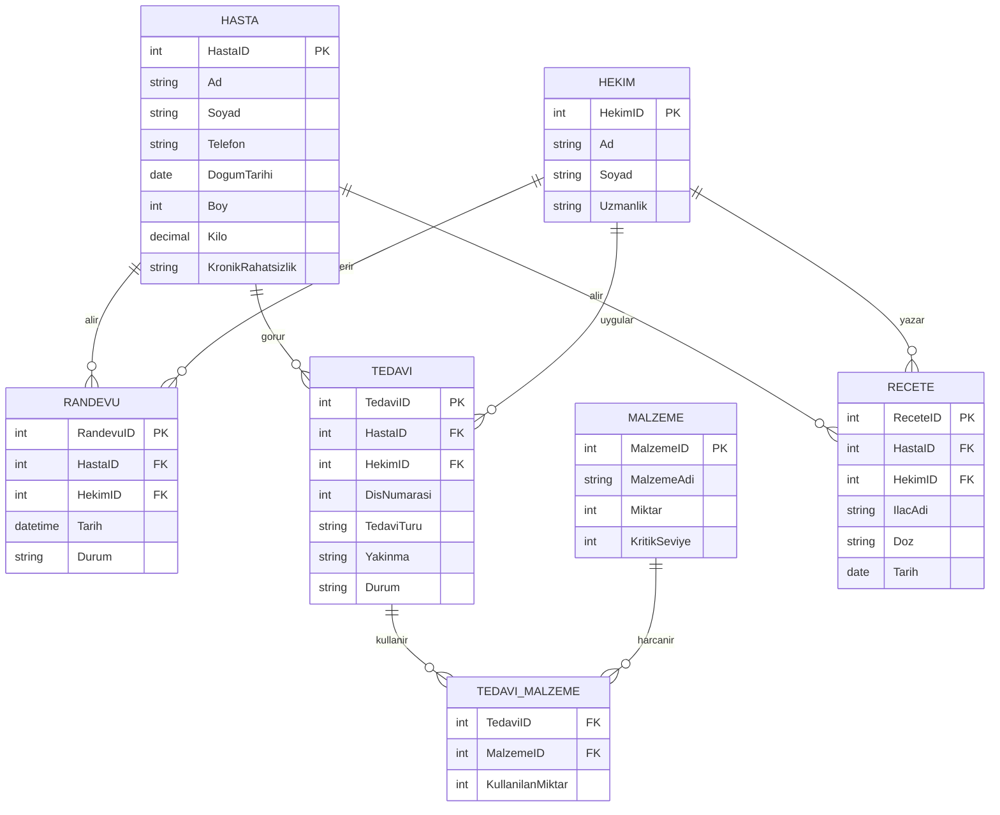

# DHBS — Diş Hekimliği Kliniği Yönetim Sistemi

Molekül Yazılım'da yaptığım staj kapsamında geliştirdiğim proje. Şirketin sitesinde gördüğüm "Diş Hekimliği" ürününden yola çıkarak, benzer bir mantıkla küçük ölçekli bir klinik yönetim sistemi kurmaya çalıştım.

Sistem iki taraftan oluşuyor: klinik personelinin kullandığı bir yönetim paneli, bir de hastaların giriş yapmadan online randevu talep edebildiği açık bir form.

## Demo

Projenin kısa bir tanıtım videosu:
https://github.com/user-attachments/assets/688b4307-be4c-4495-9080-601eacb0b4b6
## Neler var

**Yönetim paneli (giriş gerekiyor):**
- Hasta kayıtları — ekleme, düzenleme, silme, arama. Doğum tarihinden yaş otomatik hesaplanıyor, boy/kilo ve varsa kronik rahatsızlık bilgisi tutuluyor
- Hekim kayıtları, uzmanlık alanlarıyla
- Randevu takibi — bekliyor / onaylandı / tamamlandı / reddedildi diye durumlara göre filtrelenebiliyor, admin onaylayıp reddedebiliyor
- Tedavi geçmişi — hasta bazında, yakınma/şikayet bilgisiyle birlikte
- Stok takibi — malzeme kritik seviyenin altına düşünce uyarı veriyor
- Reçete — hastanın kronik bir rahatsızlığı varsa reçete yazarken ekranda uyarı çıkıyor

**Hasta tarafı:**
- Giriş yapmadan erişilebilen bir randevu formu (`/randevu-al`)
- 09:00-15:00 arası, 30 dakikalık dilimlerden saat seçilebiliyor
- Aynı hekime aynı saatte iki randevu alınmasını engelleyen bir kontrol var

## Kullandığım teknolojiler

- **Frontend:** React (Vite ile kuruldu), Tailwind CSS, React Router
- **Backend:** Node.js + Express
- **Veritabanı:** SQL Server Express, bağlantı için `mssql` paketi
- **Kimlik doğrulama:** basit kullanıcı adı/şifre girişi (proje kapsamı gereği sade tutuldu)

## Veritabanı

7 tablo var, aralarındaki ilişkiler şöyle:



`Tedavi_Malzeme` ara tablo — bir tedavide birden fazla malzeme kullanılabiliyor, bir malzeme de birden fazla tedavide geçebiliyor (çoktan çoğa ilişki). Bir tedaviye malzeme eklendiğinde, o malzemenin stok miktarını otomatik düşüren bir trigger yazdım (`trg_StokAzalt`).

## Nasıl çalıştırılır

Önce SQL Server tarafında `DisHekimligiDB` veritabanını ve tabloları oluşturman lazım (script `database/schema.sql` içinde).

Backend için:
```
cd dis-hekimligi-backend
npm install
node server.js
```
5000 portunda ayağa kalkıyor.

Frontend için ayrı bir terminalde:
```
cd dis-hekimligi-frontend
npm install
npm run dev
```
5173 portunda açılıyor, tarayıcıdan oraya gidince görebilirsin.

Admin girişi: `admin` / `admin123`
Hasta randevu formu: `/randevu-al` yoluna giriş yapmadan da ulaşılabiliyor.

## Klasör yapısı

```
dis-hekimligi-backend/
  server.js        → Express API, bütün endpoint'ler burada

dis-hekimligi-frontend/
  src/
    components/     → Sidebar, Card, RandevuTablosu gibi ortak kullanılan parçalar
    pages/          → Dashboard, Hastalar, Hekimler, Randevular, Tedaviler,
                      Stok, Receteler, HastaGecmis, Giris, RandevuAl
    App.jsx         → sayfa yönlendirme ve giriş kontrolü

database/
  schema.sql        → tablolar, trigger ve örnek veriler
```

## API uç noktaları (özet)

Hasta, Hekim, Randevu, Tedavi, Malzeme, Reçete için hepsinde aynı düzen var: `GET /api/<tablo>` listeler, `POST` yeni kayıt açar, `PUT /api/<tablo>/:id` günceller, `DELETE /api/<tablo>/:id` siler.

Bunların dışında:
- `GET /api/hastalar/:id/gecmis` — bir hastanın tüm tedavi geçmişi
- `GET /api/istatistikler` — Dashboard'daki sayılar
- `POST /api/login` — admin girişi
- `POST /api/randevular` — çakışma kontrolü de burada yapılıyor (aynı hekim, aynı saat için ikinci kayıt engelleniyor)

## Notlar

Bu bir staj projesi, gerçek bir hastanede kullanılacak seviyede değil — örneğin şifreler düz metin olarak tutuluyor, kimlik doğrulama basit tutuldu. Amaç, VTYS dersinde öğrendiğim veritabanı tasarımını (ilişkisel tablo yapısı, tetikleyiciler, çoktan-çoğa ilişkiler) ve React/Node.js ile öğrendiğim full-stack geliştirmeyi bir arada, gerçekçi bir senaryo üzerinde uygulamaktı.

— Meryem Demir
